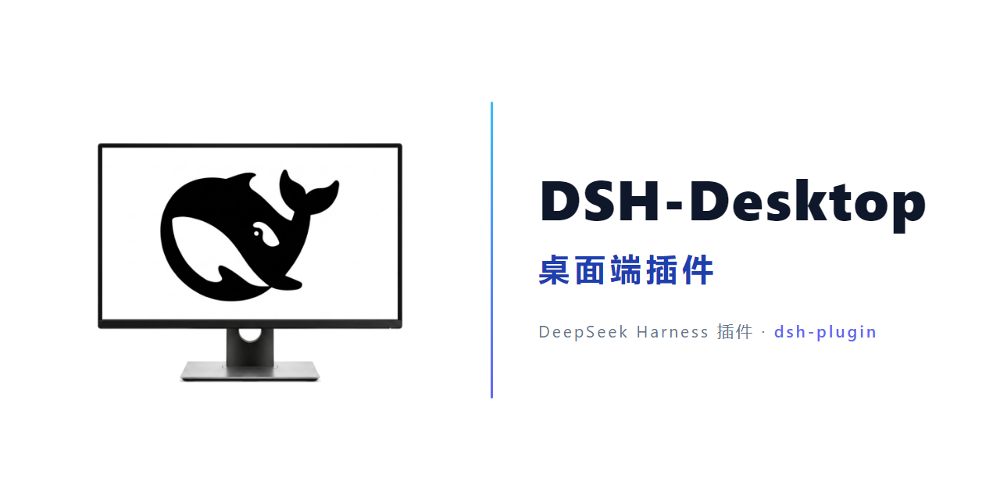

<div align="center">

[**中文**](./README.md) · [**English**](./README_EN.md)

# 🐋 Dsh-Desktop

**DeepSeek Harness 桌面端伴侣插件** —— 托盘鲸鱼图标 · 桌面快捷方式 · 开机自启（按设置打开桌面端或网页端） · 一键切换桌面/Web 模式



[](https://github.com/topics/dsh-plugin)
[](cordis.patch.yml)
[](package.json)
[](LICENSE)
[](#环境要求)
[](package.json)

**DeepSeek Harness 桌面端伴侣插件：托盘鲸鱼图标、桌面快捷方式、开机自启（按设置打开桌面端独立应用窗口或网页端浏览器），一键切换桌面/Web 模式。**

</div>

> ⚠️ **仅支持 Windows**：本插件是 **Windows 10 / 11 专用**。在 macOS / Linux 上它虽然能被加载、不会崩溃，但托盘、桌面快捷方式、开机自启等桌面功能**无法工作**（这些依赖 Windows PowerShell 与任务计划程序），请在 Windows 环境使用。

> 📌 **使用前请注意**：需要 **Node.js ≥ 20**（与 DeepSeek Harness 相同）；建议安装 **Microsoft Edge 或 Google Chrome**（应用模式桌面窗口需要 Chromium 内核，两者都无时回退为默认浏览器普通窗口）；全程**无需管理员权限**；卸载时需手动清理（托盘、自启、快捷方式、`%LOCALAPPDATA%\dsh-desktop`）。

> 🚀 **重点：桌面端 = DeepSeek Harness + 一个插件，无需任何额外安装。**
> DeepSeek Harness 的桌面体验完全以 **Web 插件** 的形式提供——不需要下载独立的桌面客户端、不需要重装、不需要管理员权限。
> 只要你的电脑上已有 DeepSeek Harness Web 环境，安装本插件后重启，即可获得完整的桌面端体验。

## ✨ 功能特性

| 特性 | 说明 |
| --- | --- |
| 🐋 **系统托盘伴侣** | 通知区域鲸鱼图标，**左键单击一键唤起/聚焦**，右键菜单提供 **打开 / 重新启动 / 退出**，随时掌控 Harness |
| 🖥️ **原生桌面窗口** | 本地 Chromium 应用模式（`--app`）渲染：1352:972 自适应比例、屏幕居中、可自由缩放；独立浏览器 profile，自动抑制 Google 翻译弹窗，扩展/通知/登录提示绝不泄漏进窗口，无启动闪烁 |
| 🔄 **一键切换桌面/Web** | 设置页按钮随当前状态显示 **切换桌面端 / 切换网页端**，状态自动检测（无需 WMI），标签始终真实可靠 |
| ⚡ **秒级启动 · 快捷方式先起服务** | 快捷方式与登录任务由专用极速启动器（`dsh-open.vbs` / `dsh-autostart.vbs`）直启服务，窗口并行准备；冷启动**提前显示内置启动页**（3–5s 可见），服务就绪后通过 **DevTools 协议原地导航**到认证地址，单窗口无缝切换、无 401 卡死、无端口冲突 |
| 🔁 **开机自启（方式二选一）** | 注册**任务计划程序登录触发器**（`DSHDesktop` 任务，无需管理员权限；`HKCU\...\Run` 仅作注册失败时的兜底）；启动器内嵌 `--no-open`，并支持 **`autoStartMode` 设置（桌面端独立窗口 / 网页端默认浏览器）**，只开所选一端，绝不重复弹出两个窗口 |
| 🚀 **全程无终端闪现** | 所有外部 PowerShell 启动（快捷方式 / 托盘 / 登录任务）都经 `wscript.exe` 隐藏运行器（Win32 `SW_HIDE`），开机、打开、切换全程**无控制台窗口闪现** |
| 🛡️ **端口安全 · 熔断保护 · 托盘自愈** | 退出后立刻重开；精确启动标记 + 端口闸门杜绝并发拉起 Node 抢端口；连续 3 次失败自动熔断写入 `launch-failures.json`；启动标记全生命周期清理 |
| 🪟 **终端显隐** | 设置页一键显示/隐藏 Harness 终端窗口，控制台随心切换 |
| ⚙️ **原生设置面板** | DSH Web UI 内新增 **桌面端** 设置区：首屏骨架屏秒开、去除冗余探测、支持开机打开方式选择、状态卡片与上次打开诊断 |

### 0.8.1 / 0.8.0 本次迭代

- **快捷方式提速**：`dsh-open.vbs` 升级为快速启动器，探测服务并直启 Node，Node 冷启动不再串行排在 PowerShell 冷启动与窗口准备之后。
- **修复开机同时弹两个窗口**：登录启动器补上 `--no-open`，彻底解决 DSH 自行弹默认浏览器与插件桌面窗口并存的必现问题。
- **新增开机打开方式设置 (`autoStartMode`)**：设置页新增开机打开方式选项（桌面端独立窗口 / 网页端默认浏览器，二选一），严格只开一端。
- **端口闸门与防无限重启**：重写 `Start-Harness` 端口等待逻辑，检测到冷启动中的 Node 进程时绝不并发拉起第二个实例；`Ensure-Harness` 增加 3 次失败自动熔断保护（写入 `launch-failures.json`）。
- **抑制 Chromium 翻译弹窗**：独立 profile 自动写入 `translate.enabled: false`，彻底消除 Chrome 138+ 弹出的 Google 翻译气泡。
- **就绪判定与端口纠错**：`Test-HarnessHttp` 拒绝启动期 404，`Wait-HarnessToken` 等待插件树完整加载后才开启窗口（解决左侧会话加载延迟）；`harness.json` 自动以 `webServer.port` 真实端口纠错。
- **性能与开销优化**：同内容跳过文件重复写入；稳态启动通过文件时间戳直接判定，不再为快捷方式/自启确认而额外启动 PowerShell；设置面板加入骨架屏并去除冗余探测。

### 0.7.8 / 0.7.7 历史迭代

## 📦 安装方法

### 环境要求

| 项目 | 要求 |
| --- | --- |
| 系统 | Windows 10 / 11（自带 Windows PowerShell 5.1） |
| 运行时 | Node.js ≥ 20（与 DeepSeek Harness 相同） |
| Harness | DeepSeek Harness Web profile（`dsh web`） |
| 浏览器 | 推荐 Chromium 系浏览器（Edge 随 Windows 自带）；桌面窗口优先使用默认浏览器（若为 Chromium 系），否则依次回退 Edge → Chrome |

### ⚡ 方式一：一条命令安装（推荐）

在任意终端执行（需要已安装并可用的 `dsh` CLI；插件管理器会处理依赖安装）：

```sh
dsh plugin --profile web add github:LvsH13/dsh-desktop
```

然后**重启正在运行的 Web profile**：

- 通知区域出现 🐋 鲸鱼托盘图标；
- 设置页出现新的 **桌面端** 区块；
- 开启自启后，登录即触发任务计划程序，秒级打开带启动页的桌面窗口（全程无终端闪现）。

### 方式二：从源码目录安装

```sh
git clone https://github.com/LvsH13/dsh-desktop.git
dsh plugin --profile web add "克隆后的 dsh-desktop 目录绝对路径"
```

同样需要重启 Web profile 后生效。

### 方式三：手动添加（Web 插件标准流程）

1. 进入 web profile 目录（默认 `%USERPROFILE%\.dsh\profiles\web`）；
2. 在 `package.json` 的 `dependencies` 中添加本包——一条命令即可完成：
   ```sh
   npm install github:LvsH13/dsh-desktop
   ```
3. 在 profile 的 `cordis.patch.yml` 的 `insert` 列表中加入：
   ```yaml
   - insert:
       - id: dsh-desktop
         name: '@dsh-external/dsh-desktop'
   ```
4. 重启 Web profile，插件生效。

### 卸载

```sh
dsh plugin --profile web remove "@dsh-external/dsh-desktop"
```

然后（可选）：退出托盘、关闭自启（删除 `DSHDesktop` 任务计划程序任务；若曾走 Run 键兜底，再删除 `HKCU\...\Run` 中的 `DSHDesktop` 键值）、删除桌面快捷方式与 `%LOCALAPPDATA%\dsh-desktop` 目录。

## 🚀 使用方法

打开 **设置 → 桌面端**：

| 面板 | 功能 |
| --- | --- |
| 状态 | Harness 服务、托盘、桌面窗口、桌面快捷方式、自启、终端的实时状态 |
| 开机自启动 | 开关登录自启（任务计划程序登录触发器，Run 键兜底）；可选择 **开机打开方式**（桌面端独立应用窗口 / 网页端默认浏览器，二选一，只开一端） |
| 操作 | **切换桌面端 / 切换网页端**（按当前模式显示标签）、启动/退出托盘、创建桌面快捷方式、显示/隐藏终端 |

托盘右键菜单中的 **重新启动** 会按顺序停止并重新启动 Harness，保留托盘图标和开机自启动设置；重启期间重复点击快捷方式或“重新启动”不会创建额外的 Node 实例。

**上次打开** 一行会报告上次启动的就绪耗时（如 `就绪耗时 1.2s`）与窗口模式（`独立窗口` / `默认浏览器`），或失败原因——遇到卡顿时先看这里。

## ⚙️ 配置说明

| 项目 | 位置 / 说明 |
| --- | --- |
| 伴生文件目录 | `%LOCALAPPDATA%\dsh-desktop\`（自动从 v0.1 的 `$DSH_HOME\desktop` 迁移） |
| `dsh-tray.ps1` | 托盘/启动器核心脚本（窗口布局、单实例、就绪轮询、退出信号） |
| `harness.json` | 记录当前安装的精确 CLI 入口、node、DSH_HOME、origin、实际绑定端口 |
| `state.json` | `showTerminal` / `autoStart` / `autoStartMode` 状态 |
| `open-state.json` | 上次打开诊断（就绪耗时、窗口模式） |
| `launch-failures.json` | 熔断诊断文件（仅在连续 3 次拉起失败触发熔断时生成，记录原因与日志路径） |
| 启动页 | `boot.html`——服务就绪前桌面窗口显示的黑色鲸鱼白底启动页，就绪后通过 DevTools 原地导航到 UI |
| 自启方式 | 任务计划程序登录触发器（`DSHDesktop` 任务，无需管理员权限）；`HKCU\...\Run` 仅注册失败时兜底；当前生效方式见 `%LOCALAPPDATA%\dsh-desktop\autostart-method.json`（`task` / `runkey`） |
| 桌面/Web 状态检测 | 双通道：记录窗口 PID（主）+ WMI 命令行匹配（兜底），无 WMI 环境同样可靠 |
| 运行时依赖 | `schemastery`（唯一运行时依赖） |

> ⚠️ 保持 `dsh-tray.ps1` 为 **UTF-8 with BOM** 编码——Windows PowerShell 5.1 会乱码读取无 BOM 的 UTF-8 文件。

## 📸 成果展示

| 🖥️ 桌面端 DeepSeek Harness | 🐋 托盘图标 |
| :---: | :---: |
|  |  |
| 📌 桌面快捷方式 | 🗔 任务栏显示 |
| :---: | :---: |
|  |  |
| ⚙️ 设置面板 · dsh-desktop | |
| :---: | :---: |
|  | |

## 📄 许可证

[MIT](./LICENSE) · Copyright © 2026 [LvsH13](https://github.com/LvsH13)

---

<div align="center">

🔖 本仓库属于 **dsh-plugin** 生态：[dsh-plugin 话题](https://github.com/topics/dsh-plugin) · [GitHub 仓库](https://github.com/LvsH13/dsh-desktop)

</div>
