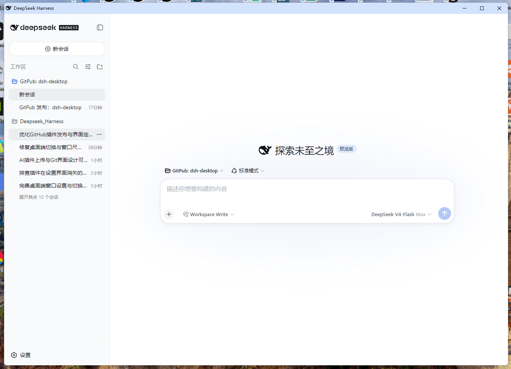
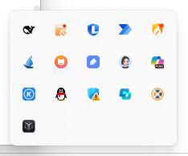
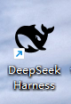
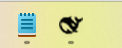
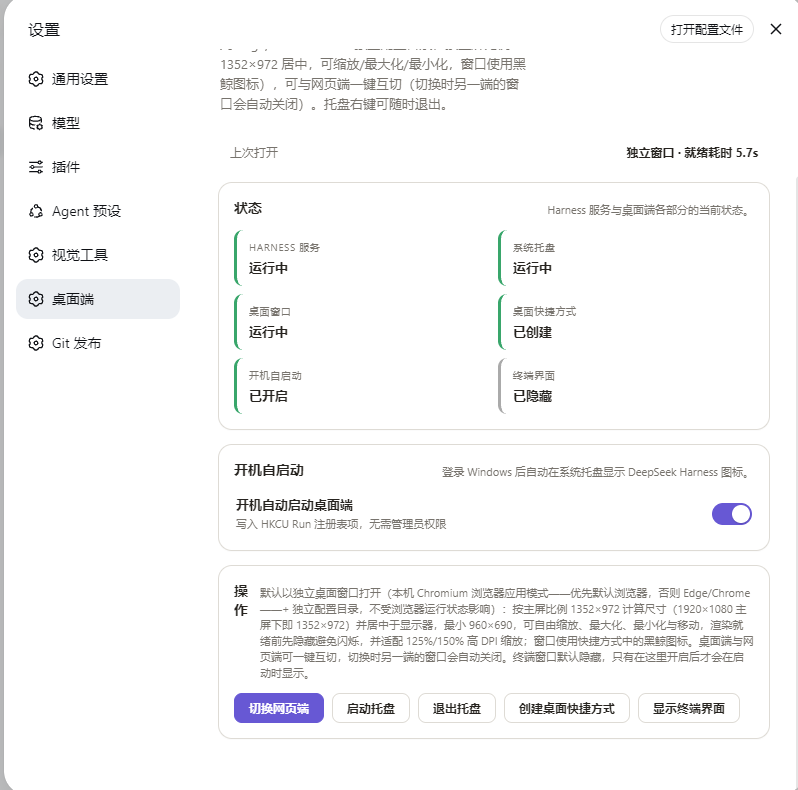

<div align="center">

[**中文**](./README.md) · [**English**](./README_EN.md)

# 🐋 @dsh-external/dsh-desktop

**DeepSeek Harness 桌面端伴侣插件** —— 托盘鲸鱼图标 · 桌面快捷方式 · 开机自启直达桌面窗口 · 一键切换桌面/Web 模式


[](https://github.com/topics/dsh-plugin)
[](cordis.patch.yml)
[](package.json)
[](LICENSE)
[](#环境要求)
[](package.json)

**DeepSeek Harness 桌面端伴侣插件：托盘鲸鱼图标、桌面快捷方式、开机自启直达桌面窗口，一键切换桌面/Web 模式。**

</div>

> 🚀 **重点：桌面端 = DeepSeek Harness + 一个插件，无需任何额外安装。**
> DeepSeek Harness 的桌面体验完全以 **Web 插件** 的形式提供——不需要下载独立的桌面客户端、不需要重装、不需要管理员权限。
> 只要你的电脑上已有 DeepSeek Harness Web 环境，安装本插件后重启，即可获得完整的桌面端体验。

## ✨ 功能特性

| 特性 | 说明 |
| --- | --- |
| 🐋 **系统托盘伴侣** | 通知区域鲸鱼图标，右键菜单一键 **打开 / 退出**，随时掌控 Harness |
| 🖥️ **原生桌面窗口** | 本地 Chromium 应用模式（`--app`）渲染：1352:972 自适应比例、屏幕居中、可自由缩放；独立浏览器 profile，扩展/通知/登录提示绝不泄漏进窗口，无启动闪烁 |
| 🔄 **一键切换桌面/Web** | 设置页按钮随当前状态显示 **切换桌面端 / 切换网页端**，状态自动检测（无需 WMI），标签始终真实可靠 |
| ⚡ **秒级启动** | 直接以 `node <entry> web` 启动 Harness（精确入口记录于 `harness.json`），登录自启就绪仅需数秒，无 npx 网络往返、无端口冲突 |
| 🔁 **开机自启** | 写入 `HKCU\...\Run`（无需管理员权限），登录后后台拉起服务并**直接打开桌面窗口** |
| 🪟 **终端显隐** | 设置页一键显示/隐藏 Harness 终端窗口，控制台随心切换 |
| ⚙️ **原生设置面板** | DSH Web UI 内新增 **桌面端** 设置区：状态卡片、一键操作、上次打开诊断 |

## 📦 安装方法

### 环境要求

| 项目 | 要求 |
| --- | --- |
| 系统 | Windows 10 / 11（自带 Windows PowerShell 5.1） |
| 运行时 | Node.js ≥ 20（与 DeepSeek Harness 相同） |
| Harness | DeepSeek Harness Web profile（`dsh web`） |
| 浏览器 | 推荐 Chromium 系浏览器（Edge 随 Windows 自带）；桌面窗口优先使用默认浏览器（若为 Chromium 系），否则依次回退 Edge → Chrome |

### ⚡ 方式一：一条命令安装（推荐）

在任意终端执行（需要 `dsh` CLI 与 pnpm，DSH 插件管理依赖 pnpm）：

```sh
dsh plugin --profile web add github:LvsH13/dsh-desktop
```

然后**重启正在运行的 Web profile**：

- 通知区域出现 🐋 鲸鱼托盘图标；
- 设置页出现新的 **桌面端** 区块；
- 开启自启后，登录即直接打开桌面窗口。

### 方式二：从源码目录安装

```sh
git clone https://github.com/LvsH13/dsh-desktop.git
dsh plugin --profile web add "FULL/PATH/TO/dsh-desktop"
```

同样需要重启 Web profile 后生效。

### 方式三：手动添加（Web 插件标准流程）

1. 进入 web profile 目录（默认 `%USERPROFILE%\.dsh\profiles\web`）；
2. 在 `package.json` 的 `dependencies` 中添加本包——一条命令即可完成：
   ```sh
   npm install github:LvsH13/dsh-desktop
   ```
3. 在 profile 的 `cordis.patch.yml` 的 `insert` 列表中加入：
   ```yaml
   - insert:
       - id: dsh-desktop
         name: '@dsh-external/dsh-desktop'
   ```
4. 重启 Web profile，插件生效。

### 卸载

```sh
dsh plugin --profile web remove "@dsh-external/dsh-desktop"
```

然后（可选）：退出托盘、关闭自启（删除 `HKCU\...\Run` 中的 `DSHDesktop` 键值）、删除桌面快捷方式与 `%LOCALAPPDATA%\dsh-desktop` 目录。

## 🚀 使用方法

打开 **设置 → 桌面端**：

| 面板 | 功能 |
| --- | --- |
| 状态 | Harness 服务、托盘、桌面窗口、桌面快捷方式、自启、终端的实时状态 |
| 开机自启动 | 开关登录自启（`HKCU Run`）；开启后登录即在后台拉起服务并直接打开桌面窗口 |
| 操作 | **切换桌面端 / 切换网页端**（按当前模式显示标签）、启动/退出托盘、创建桌面快捷方式、显示/隐藏终端 |

**上次打开** 一行会报告上次启动的就绪耗时（如 `就绪耗时 1.2s`）与窗口模式（`独立窗口` / `默认浏览器`），或失败原因——遇到卡顿时先看这里。

## ⚙️ 配置说明

| 项目 | 位置 / 说明 |
| --- | --- |
| 伴生文件目录 | `%LOCALAPPDATA%\dsh-desktop\`（自动从 v0.1 的 `$DSH_HOME\desktop` 迁移） |
| `dsh-tray.ps1` | 托盘/启动器核心脚本（窗口布局、单实例、就绪轮询、退出信号） |
| `harness.json` | 记录当前安装的精确 CLI 入口、node、DSH_HOME、origin、端口 |
| `state.json` | `showTerminal` / `autoStart` 状态 |
| `open-state.json` | 上次打开诊断（就绪耗时、窗口模式） |
| 自启注册表 | `HKCU\Software\Microsoft\Windows\CurrentVersion\Run\DSHDesktop` |
| 桌面/Web 状态检测 | 双通道：记录窗口 PID（主）+ WMI 命令行匹配（兜底），无 WMI 环境同样可靠 |
| 运行时依赖 | `schemastery`（唯一运行时依赖） |

> ⚠️ 保持 `dsh-tray.ps1` 为 **UTF-8 with BOM** 编码——Windows PowerShell 5.1 会乱码读取无 BOM 的 UTF-8 文件。

## 📸 成果展示

| 🖥️ 桌面端 DeepSeek Harness | 🐋 托盘图标 |
| :---: | :---: |
|  |  |
| 📌 桌面快捷方式 | 🗔 任务栏显示 |
| :---: | :---: |
|  |  |
| ⚙️ 设置面板 · dsh-desktop | |
| :---: | :---: |
|  | |

## 📄 许可证

[MIT](./LICENSE) · Copyright © 2026 [LvsH13](https://github.com/LvsH13)

---

<div align="center">

🔖 本仓库属于 **dsh-plugin** 生态：[dsh-plugin 话题](https://github.com/topics/dsh-plugin) · [GitHub 仓库](https://github.com/LvsH13/dsh-desktop)

</div>
